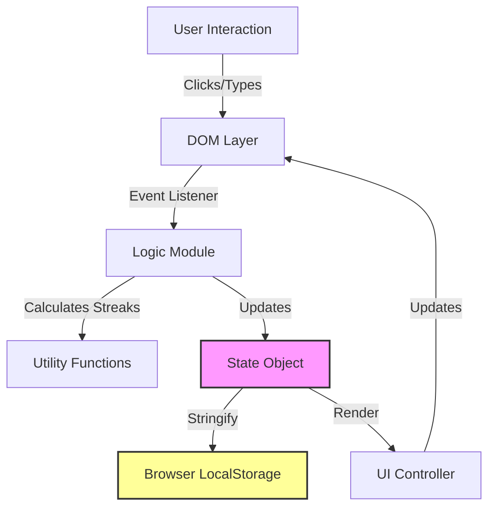

<div align="center">

# 🎯 FocusFlow
### Zero-Distraction Learning Streak Keeper

[](https://opensource.org/licenses/MIT)
[](https://developer.mozilla.org/en-US/docs/Web/HTML)
[](https://developer.mozilla.org/en-US/docs/Web/JavaScript)
[]()

**A client-side tool for autodidacts who value consistency over gamification.**

[▶️ Live Demo](https://aliriyaj007.github.io/FocusFlow/) &nbsp;•&nbsp; [📥 Download Source](https://github.com/Aliriyaj007/FocusFlow/archive/refs/heads/main.zip)

</div>

---

## 📖 The Philosophy

**Problem:** Modern learning apps are Skinner boxes. They use notifications, streak-freezes, social leaderboards, and "bells and whistles" to keep you hooked on the *app*, not the *learning*. They are noisy distractions disguised as productivity tools.

**Solution:** FocusFlow is a digital mirror. It is silent, private, and requires zero permissions. It exists solely to reflect your effort back to you. If you forget to check in, nothing breaks—except your streak. That is the point.

---

## ⚖️ Before vs. After

| Aspect | Typical "Habit" Apps | FocusFlow |
| :--- | :--- | :--- |
| **Onboarding** | Email, Password, Credit Card, 10 Tutorials | Open File. Type Goal. Done. |
| **Data** | Locked on a proprietary server | Stored in your browser (LocalStorage) |
| **Privacy** | Tracked for ad targeting | Zero tracking. Zero analytics. |
| **Motivation** | Push notifications and guilt | Visual satisfaction & self-discipline |
| **Connectivity** | Requires Internet | Works offline completely |

---

## 🚀 Quick Start ( < 60 Seconds )

1.  **Download:** Save the `index.html` file to your computer.
2.  **Open:** Double-click the file to open it in your browser.
3.  **Input:** Type your goal (e.g., "Learn Rust").
4.  **Act:** Click the circle next to your goal for today.
5.  **Result:** Your streak begins.

That’s it. No setup, no sign-up, no sync delays.

---

## ✨ Features

FocusFlow merges Basic, Enhanced, and Advanced tracking paradigms into a single, unified interface.

| Feature | Description | Tech |
| :--- | :--- | :--- |
| **Multi-Goal Tracking** | Track different skills (Languages, Coding, Music) simultaneously. | Vanilla JS State Management |
| **SVG Calendar & Heatmap** | Visualize consistency using a crisp, zoomable SVG interface. No pixelation. | Dynamic DOM Generation |
| **Premium Themes** | 7 built-in, developer-centric themes (Indigo, Midnight, Graphite, etc.). | CSS Variables |
| **Zen Mode** | Hides all stats and numbers. Just you and the habit. | CSS Toggles |
| **Data Sovereignty** | Full Backup (Export JSON) and Restore (Import JSON) capabilities. | FileReader / Blob APIs |
| **Offline Ready** | Once loaded, it requires no internet connection. | PWA-friendly Structure |

---

## 🏗️ Architecture

FocusFlow adheres to a strict **Client-Side Only** architecture. There is no backend logic, database, or external API calls.



### Core Modules
The codebase is modularized using the **IIFE (Immediately Invoked Function Expression)** pattern to prevent global namespace pollution:

1.  **`Store`**: Handles `localStorage` serialization/deserialization.
2.  **`Logic`**: Pure functions for date math and array manipulation.
3.  **`Utils`**: Helper functions for formatting dates and generating IDs.
4.  **`UI`**: Handles DOM manipulation, event binding, and theme switching.

---

## 🛠️ Installation & Usage

### Method 1: Direct Web App (Easiest)
Simply visit the hosted GitHub Pages link:
> **[https://aliriyaj007.github.io/FocusFlow/](https://aliriyaj007.github.io/FocusFlow/)**

### Method 2: Local File (Most Private)
1.  Download the repository as a ZIP.
2.  Extract `index.html`.
3.  Drag and drop into your browser.
4.  *Tip:* You can host this file on Dropbox, Google Drive, or a private server and access it from anywhere.

### Method 3: Fork & Customise
If you are a developer, fork the repo to add custom metrics or themes.
```bash
git clone https://github.com/Aliriyaj007/FocusFlow.git
cd FocusFlow
# Open index.html in your preferred editor (VS Code, Sublime, etc.)
```

---

## ⚙️ Customization

FocusFlow is designed to be hacked. You can easily modify the `const themes` array in the script section to add your own color palettes.

**To change the default language or date format:**
Edit the `Utils.formatDate` function in the source code.

---

## 🤝 Contributing

Contributions are welcome, but keep the philosophy in mind:
1.  **No Dependencies:** Do not add npm packages, webpack, or build steps.
2.  **No AI:** Do not add AI features.
3.  **Single File:** New features should fit within the single-file architecture.

**Workflow:**
1.  Fork the project.
2.  Create your feature branch (`git checkout -b feature/AmazingFeature`).
3.  Commit your changes (`git commit -m 'Add some AmazingFeature'`).
4.  Push to the branch (`git push origin feature/AmazingFeature`).
5.  Open a Pull Request.

---

## 📜 License

This project is licensed under the MIT License - see the [LICENSE](LICENSE) file for details.

---

## 👤 Author

**Riyajul Ali**

*   GitHub: [Aliriyaj007](https://github.com/Aliriyaj007)
*   Email: [aliriyaj007@protonmail.com](mailto:aliriyaj007@protonmail.com)
*   LinkedIn: [linkedin.com/in/Aliriyaj007](https://linkedin.com/in/Aliriyaj007)
*   Web App: [https://aliriyaj007.github.io/FocusFlow/](https://aliriyaj007.github.io/FocusFlow/)

---

<div align="center">
  <sub>Built with ❤️ using pure HTML, CSS, and JavaScript.</sub>
</div>
